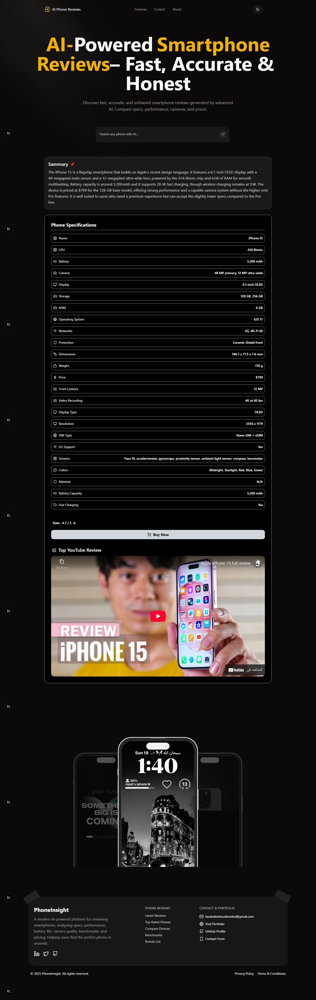

# AI-PhoneReviews — Intelligent Mobile Review Platform

AI-PhoneReviews is an enterprise-grade, AI-powered platform designed to analyze smartphone hardware specifications and generate high-quality, reviewer-style insights. The system leverages advanced language models to deliver accurate, unbiased, and concise evaluations, enabling users to make data-driven smartphone purchase decisions.

## 🚀 Key Capabilities
- **AI-Generated Technical Summaries:** Balanced, professional insights focused on real-world performance.
- **Automated Pros & Cons Extraction:** Highlights strengths and weaknesses without bias.
- **Dynamic Specification Visualization:** Clean, responsive specs table with structured data.
- **Integrated Video Review Engine:** Fetches and displays relevant YouTube review content.
- **Global State Management:** Powered by Zustand for consistent and predictable application behavior.
- **Modern UI/UX:** Built with Tailwind CSS, ShadCN components, and Framer Motion animations.

## 🧠 Technology Stack
- **Framework:** Next.js 16 (App Router)
- **UI Layer:** React 19 + Tailwind CSS + ShadCN/UI
- **State Management:** Zustand
- **Animations:** Framer Motion
- **Icons:** Lucide-React
- **AI Layer:** Custom API route for model-driven review generation

## 🏗️ Solution Architecture
```
components/
  ├─ PhoneSummary.tsx       # Renders AI-generated summary
  ├─ PhoneSpecsTable.tsx    # Main specifications table
  ├─ VideoReview.tsx        # YouTube review integration
store/
  ├─ PhoneStore.ts          # Global Zustand store
app/api/
  ├─ phone-review/route.ts  # AI-powered review generator
public/
  ├─ phones.json            # Device suggestion dataset
```

## 🔍 System Workflow
1. User selects or searches for a smartphone.
2. Device specifications are forwarded to the AI review service.
3. The system returns:
   - A concise professional summary
   - Pros & cons
   - Rating insights
4. The UI renders the structured output.
5. Zustand ensures state persistence throughout the user session.

## 🎯 Project Objective
The objective of AI-PhoneReviews is to deliver a **trusted, enterprise-grade AI reviewing engine** capable of:
- Simplifying complex hardware data into digestible insights
- Providing consistent, unbiased evaluations
- Reducing research time for consumers and professionals
- Enhancing decision-making through structured, AI-powered analysis

## 📈 Roadmap & Enhancements
- Cross-device comparison workspace
- Real-time price integration from global markets
- Multi-language support
- User accounts with personalized recommendation models
- Enhanced analytics dashboard for review performance

---
For additional documentation, deployment guidelines, or API specifications, feel free to request an extended enterprise doc suite.
 
 screenshoot:

